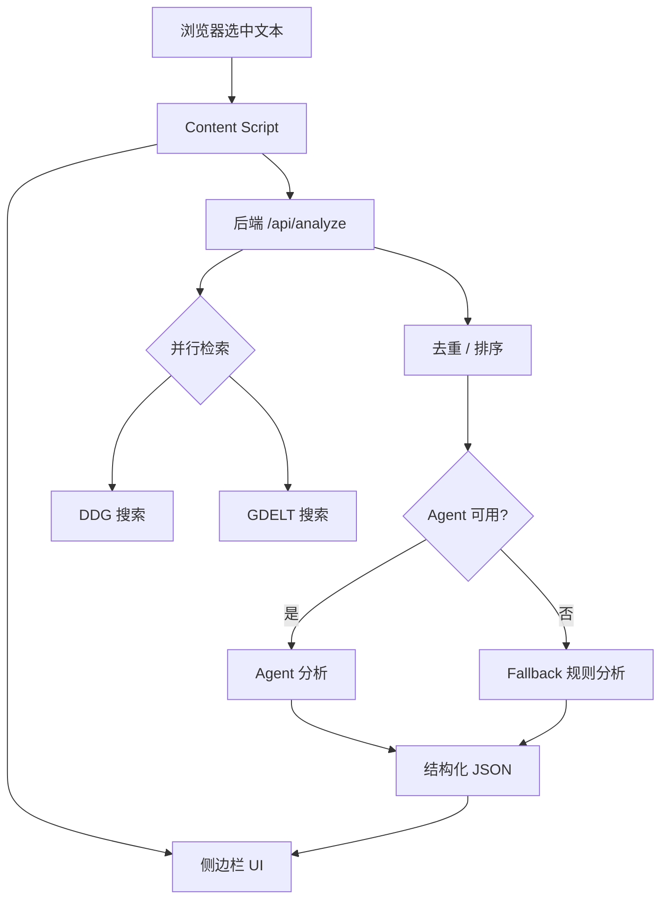

# BubblePop Narrative

划词触发的新闻叙事分析扩展。前端为浏览器扩展侧边栏，后端为结构化分析服务，支持 DDG + GDELT 搜索与多步智能体输出。

---

## 功能
- 划词触发：选中网页文本即触发搜索与分析
- 搜索聚合：DuckDuckGo + GDELT 并行检索
- 结构化输出：摘要 / 时间脉络 / 立场 / 关联事件
- 渐进展示：搜索结果先显示，分析完成后补齐
- 侧边栏 UI：分区折叠、卡片式阅读

---

## 总体流程（字符图）

```
[用户选中文本]
        |
        v
[Content Script 捕获文本]
        |
        +--> [POST /api/search] -> 返回搜索结果(先显示)
        |
        +--> [POST /api/analyze] -> Agent/规则 -> 结构化结果
        |
        v
[侧边栏 UI 渐进渲染]
```

---

## 系统架构（Mermaid）



---

## UI 草图（字符图）

```
┌──────────────────────────────────────────┐
│ 划词搜新闻                           [×] │
│ 选中文本：xxxxxxxxxxxxx                │
│ [重新分析] [设置]                      │
├──────────────────────────────────────────┤
│ 处理进度                                │
│ • 搜索新闻：已获取 N 条                  │
│ • 结构化分析：处理中                     │
├──────────────────────────────────────────┤
│ 搜索结果  (可折叠)                       │
│  ┌──────────────────────────────────┐    │
│  │ 标题… [展开]                      │    │
│  │ 摘要…                             │    │
│  │ 来源 · 时间                         │    │
│  └──────────────────────────────────┘    │
│                                           │
│ 事件摘要  (可折叠)                         │
│ 时间脉络  (可折叠)                         │
│ 立场分析  (可折叠)                         │
│ 关联事件  (可折叠)                         │
└──────────────────────────────────────────┘
```

---

## 多智能体架构（重点详述）
本项目不是“单一模型一把梭”，而是 **多智能体协作流水线**。核心目标是：  
**先把“可用的新闻候选”搜对，再把“可读的结构化结论”写对。**

### 总体分工
1. **策略智能体（Strategy Agent）**  
   - **职责**：将用户划词文本转为多角度检索策略  
   - **输出**：多条查询（含优先级 + 角度标签 + 可能的多语种/多视角）  
   - **价值**：降低“只搜一个角度”的偏差，提升召回与覆盖

2. **筛选智能体（Filter Agent）**  
   - **职责**：对候选结果做“新闻/背景/噪音”分类  
   - **输出**：保留新闻为主，允许少量背景  
   - **价值**：避免百科/论坛/广告噪音干扰最终分析

3. **选择智能体（Select Agent）**  
   - **职责**：在候选中挑选最具信息量与可信度的条目  
   - **输出**：最终可用的新闻清单  
   - **价值**：在“过多候选”情况下控制质量与篇幅

4. **分析智能体（Analysis Agent）**  
   分成四个明确子任务，保证结构化输出：  
   - **内容总结**：一句话总结核心事实  
   - **时间轴梳理**：抽取时间节点并按顺序组织  
   - **立场分析**：识别利益相关方与观点  
   - **关联推荐**：联想历史相关事件或结构性对比

### 为什么需要多智能体
- **分而治之**：搜索策略、筛选、结构化分析是不同问题，不宜用同一提示词解决  
- **可控性**：每一步都有明确输入/输出，便于调试与扩展  
- **稳定性**：任一环节失败可降级（如 fallback 或减少步骤）  
- **可演进**：未来可插入“去重智能体”“可信度校验智能体”等

### 关键约束
- 输出为严格 JSON  
- 除媒体名/专有名词外，中文输出  
- 结果可被后端排序与前端渐进展示

---

## 运行与测试

### 1) 安装依赖
```bash
npm install
```

### 2) 启动（前后端同时）
```bash
npm run dev
```

### 3) 测试（后端 API， 多开一个命令行）
```bash
curl -s http://localhost:8787/health

curl -s -X POST http://localhost:8787/api/analyze \
  -H 'content-type: application/json' \
  -H 'x-agent-key: <YOUR_GLM_KEY>' \
  -d '{"query":"王楚钦亚洲杯复出首战速胜","region":"cn-zh","context":{"currentUrl":"https://example.com"}}'
```

### 4) 调试模式（可选）
```bash
GDELT_INSECURE=1 AGENT_DEBUG=1 npm run dev
```

---

## 目录结构
```
.
├─ entrypoints/            # 扩展入口
├─ src/                    # UI 组件
├─ news-plugin-backend/    # 后端服务
└─ README.md
```

---

## 安全与密钥
- 本仓库不提交任何 API Key
- 本地密钥放在 `news-plugin-backend/.env`（已被 `.gitignore` 忽略）
- 扩展侧边栏设置页可存储 Key 到本地 storage
