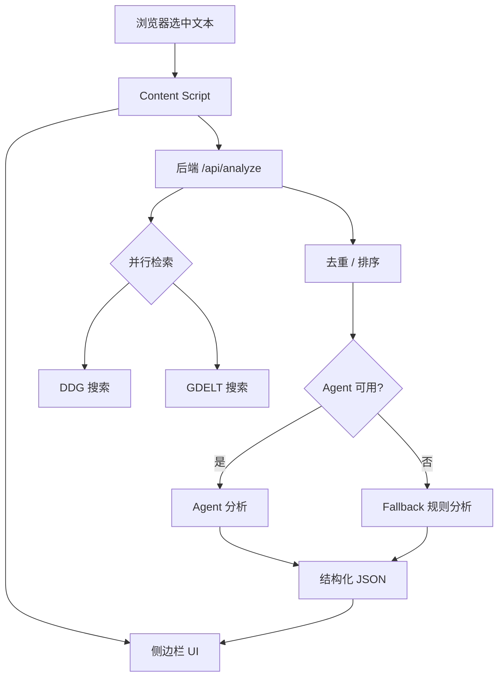

# BubblePop Narrative

划词触发的新闻叙事分析扩展。前端为浏览器扩展侧边栏，后端为结构化分析服务，支持 DDG + GDELT 搜索与多步智能体输出。

---

## 功能
- 划词触发：选中网页文本即触发搜索与分析
- 搜索聚合：DuckDuckGo + GDELT 并行检索
- 结构化输出：摘要 / 时间脉络 / 立场 / 关联事件
- 渐进展示：搜索结果先显示，分析完成后补齐
- 侧边栏 UI：分区折叠、卡片式阅读

---

## 总体流程

```
[用户选中文本]
        |
        v
[Content Script 捕获文本]
        |
        +--> [POST /api/search] -> 返回搜索结果(先显示)
        |
        +--> [POST /api/analyze] -> Agent/规则 -> 结构化结果
        |
        v
[侧边栏 UI 渐进渲染]
```

---

## 系统架构



---

## UI 草图

```
┌──────────────────────────────────────────┐
│ 划词搜新闻                           [×] │
│ 选中文本：xxxxxxxxxxxxx                  │
│ [重新分析] [设置]                        │
├──────────────────────────────────────────┤
│ 处理进度                                 │
│ • 搜索新闻：已获取 N 条                  │
│ • 结构化分析：处理中                      │
├──────────────────────────────────────────┤
│ 搜索结果  (可折叠)                        │
│  ┌──────────────────────────────────┐    │
│  │ 标题… [展开]                      │    │
│  │ 摘要…                             │    │
│  │ 来源 · 时间                       │    │
│  └──────────────────────────────────┘    │
│                                          │
│ 事件摘要  (可折叠)                        │
│ 时间脉络  (可折叠)                        │
│ 立场分析  (可折叠)                        │
│ 关联事件  (可折叠)                        │
└──────────────────────────────────────────┘
```

---

## 多智能体架构

本项目不是"单一模型一把梭"，而是 **多智能体协作流水线**。核心目标是：
**先把"可用的新闻候选"搜对，再把"可读的结构化结论"写对。**

### 总体分工

1. **策略智能体（Strategy Agent）**
   - **职责**：将用户划词文本转为多角度检索策略
   - **输出**：多条查询（含优先级 + 角度标签 + 可能的多语种/多视角）
   - **价值**：降低"只搜一个角度"的偏差，提升召回与覆盖

2. **筛选智能体（Filter Agent）**
   - **职责**：对候选结果做"新闻/背景/噪音"分类
   - **输出**：保留新闻为主，允许少量背景
   - **价值**：避免百科/论坛/广告噪音干扰最终分析

3. **选择智能体（Select Agent）**
   - **职责**：在候选中挑选最具信息量与可信度的条目
   - **输出**：最终可用的新闻清单
   - **价值**：在"过多候选"情况下控制质量与篇幅

4. **分析智能体（Analysis Agent）**
   分成四个明确子任务，保证结构化输出：
   - **内容总结**：一句话总结核心事实
   - **时间轴梳理**：抽取时间节点并按顺序组织
   - **立场分析**：识别利益相关方与观点
   - **关联推荐**：联想历史相关事件或结构性对比

### 为什么需要多智能体
- **分而治之**：搜索策略、筛选、结构化分析是不同问题，不宜用同一提示词解决
- **可控性**：每一步都有明确输入/输出，便于调试与扩展
- **稳定性**：任一环节失败可降级（如 fallback 或减少步骤）
- **可演进**：未来可插入"去重智能体""可信度校验智能体"等

### 关键约束
- 输出为严格 JSON
- 除媒体名/专有名词外，中文输出
- 结果可被后端排序与前端渐进展示

---

## 环境要求

| 依赖 | 版本要求 | 说明 |
|------|---------|------|
| Node.js | >= 18 | 后端 Express 服务 + 前端 WXT 构建 |
| Python | >= 3.9 | DDG 搜索脚本 + 智能体运行器 |
| 智谱 AI API Key | - | 用于多智能体分析，[申请地址](https://open.bigmodel.cn/) |

Python 依赖：
- `ddgs` -- DuckDuckGo 搜索
- `zhipuai` -- 智谱 AI SDK

---

## 目录结构

```
.
├─ entrypoints/                # 浏览器扩展入口
│  ├─ background/              #   Service Worker
│  ├─ content/                 #   Content Script（划词监听 + 侧边栏挂载）
│  └─ options/                 #   扩展设置页
├─ src/
│  ├─ components/              # React UI 组件（Sidebar / Timeline / StancesPanel 等）
│  └─ styles/                  # 样式
├─ news-plugin-backend/        # 后端 API 服务
│  ├─ src/
│  │  ├─ server.js             #   HTTP 入口（默认 0.0.0.0:7860）
│  │  ├─ app.js                #   Express 应用（CORS / Helmet / 路由注册）
│  │  ├─ routes/               #   路由：health / search / analyze / news / validate
│  │  ├─ services/             #   服务：DDG / GDELT / Agent
│  │  ├─ middleware/           #   错误处理 / 404
│  │  └─ utils/                #   工具函数
│  ├─ python/
│  │  ├─ Agent.py              #   ReAct 多步分析器（调用 GLM-4-Flash）
│  │  ├─ agent_runner.py       #   Python 入口（stdin/stdout 与 Node.js 通信）
│  │  └─ ddg_search.py         #   DuckDuckGo 搜索脚本
│  ├─ requirements.txt         #   Python 依赖
│  ├─ .env.example             #   环境变量模板
│  └─ package.json
├─ api.ts                      # 前端 API 调用封装
├─ types.ts                    # 类型定义
├─ selectionListener.ts        # 划词监听器
├─ wxt.config.ts               # WXT 扩展构建配置
├─ Dockerfile                  # 魔搭创空间部署用
└─ README.md
```

---

## 本地开发配置（Windows）

### 1) 安装 Python 依赖

确保系统已安装 Python >= 3.9，然后安装后端 Python 脚本所需的包（国内建议使用清华镜像）：

```bash
pip install ddgs zhipuai -i https://pypi.tuna.tsinghua.edu.cn/simple
```

- `ddgs` -- 被 `news-plugin-backend/python/ddg_search.py` 使用，提供 DuckDuckGo 搜索能力
- `zhipuai` -- 被 `news-plugin-backend/python/Agent.py` 和 `agent_runner.py` 使用，调用智谱 GLM 大模型

> 这些包安装在系统 Python 环境中即可，后端通过 `spawn` 调用 Python 解释器执行脚本。

### 2) 安装 Node.js 依赖

项目有两个独立的 `package.json`，需要分别安装：

```bash
# 项目根目录（前端浏览器扩展：React / WXT 等）
npm install

# 后端目录（Express / Axios / Zod 等）
cd news-plugin-backend
npm install
cd ..
```

### 3) 配置后端环境变量

```bash
cd news-plugin-backend
copy .env.example .env
```

编辑 `.env`，填写以下关键项：

```ini
# Python 解释器路径（直接写 python 或完整路径）
SEARCH_PYTHON=python

# 智谱 AI API Key（必填，否则智能体分析不可用）
ZAI_API_KEY=你的Key
```

> **Windows 注意**：`package.json` 中的 `dev:server` 脚本已移除 Linux 风格的
> `SEARCH_PYTHON=...` 前缀赋值，改为从 `.env` 文件读取。

### 4) 启动开发服务

```bash
npm run dev
```

该命令会同时启动：
- 后端 Express API 服务 -> `http://localhost:7860`
- 前端 WXT 开发服务器 -> 自动构建扩展到 `.output/chrome-mv3-dev`

### 5) 加载浏览器扩展

1. 打开 Chrome，访问 `chrome://extensions/`
2. 开启右上角 **开发者模式**
3. 点击 **加载已解压的扩展程序**
4. 选择目录 `.output/chrome-mv3-dev`

### 6) 使用

在任意网页上**选中一段文本**（划词），右侧侧边栏将自动弹出，依次展示搜索结果和结构化分析。

---

## API 接口

后端默认监听 `http://0.0.0.0:7860`。

| 接口 | 方法 | 说明 |
|------|------|------|
| `/health` | GET | 健康检查 |
| `/api/search` | POST | DDG 搜索 |
| `/api/analyze` | POST | 完整分析（搜索 + 多智能体） |
| `/api/news` | POST | 简化版新闻列表 |
| `/api/validate/ddg` | POST | 验证 DDG 服务可用性 |
| `/api/validate/agent` | POST | 验证智谱 API Key |

### 测试示例

```bash
# 健康检查
curl http://localhost:7860/health

# 搜索
curl -X POST http://localhost:7860/api/search \
  -H "content-type: application/json" \
  -d '{"query":"特朗普关税","region":"cn-zh"}'

# 完整分析
curl -X POST http://localhost:7860/api/analyze \
  -H "content-type: application/json" \
  -d '{"query":"特朗普关税","region":"cn-zh","context":{"currentUrl":"https://example.com"}}'
```

---

## 魔搭创空间部署

项目已配置 `Dockerfile`，可直接部署到魔搭 ModelScope 创空间。

### Dockerfile 概要

- 基础镜像：`modelscope-registry.cn-beijing.cr.aliyuncs.com/modelscope-repo/python:3.10`
- 额外安装 Node.js 18（npmmirror 国内镜像）
- pip / npm 依赖均使用国内镜像加速
- 工作目录：`/app/news-plugin-backend`
- 入口：`node src/server.js`
- 监听：`0.0.0.0:7860`

### 环境变量

在魔搭控制台 **"设置" -> "环境变量"** 中配置：

| 变量名 | 必填 | 说明 |
|--------|------|------|
| `ZAI_API_KEY` | 是 | 智谱 AI API 密钥 |

其余变量已在 Dockerfile 中设置默认值（`PORT=7860`、`CORS_ORIGINS=*`、`SEARCH_PYTHON=python3` 等），无需额外配置。

---

## 环境变量说明

完整环境变量参见 `news-plugin-backend/.env.example`，关键项：

| 变量 | 默认值 | 说明 |
|------|--------|------|
| `PORT` | `7860` | 服务端口 |
| `CORS_ORIGINS` | `*` | 允许的跨域来源 |
| `SEARCH_PYTHON` | `python3` | Python 解释器路径 |
| `ZAI_API_KEY` | - | 智谱 AI 密钥（必填） |
| `AGENT_MODE` | `process` | 智能体模式：`process` / `http` / `none` |
| `AGENT_TIMEOUT_MS` | `120000` | 智能体超时时间（毫秒） |
| `DDG_REGION` | `cn-zh` | DDG 搜索地区 |
| `GDELT_INSECURE` | `0` | 设为 `1` 可跳过 GDELT TLS 验证 |
| `AGENT_DEBUG` | `0` | 设为 `1` 输出智能体原始响应到日志 |

---

## 安全与密钥
- 本仓库不提交任何 API Key
- 本地密钥放在 `news-plugin-backend/.env`（已被 `.gitignore` 忽略）
- 云端部署通过平台环境变量注入
- 扩展侧边栏设置页可存储 Key 到本地 storage

---

## 常见问题

| 问题 | 解决方案 |
|------|----------|
| Windows 下 `SEARCH_PYTHON=... npm run dev` 报错 | Linux shell 语法不兼容 Windows。改为在 `.env` 中设置 `SEARCH_PYTHON`，`package.json` 已修复 |
| PowerShell 中 `curl` 被识别为 `Invoke-WebRequest` | 使用 `curl.exe` 代替 `curl` |
| `ddgs/duckduckgo_search not available` | Python 环境中未安装 ddgs，执行 `pip install ddgs` |
| DDG 搜索中文乱码 | `ddg_search.py` 已添加 Windows UTF-8 编码修复 |
| GDELT TLS 错误 | 在 `.env` 中设置 `GDELT_INSECURE=1` |
| Agent 超时 | 增大 `AGENT_TIMEOUT_MS` 或减少输入文本长度 |
| 侧边栏显示"分析请求失败" | 检查后端是否启动、API Key 是否配置、浏览器 F12 控制台报错信息 |
